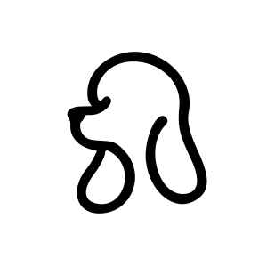

  

  
    
  # [Sevingu](https://www.sevingu.com/)
  
  

Sevingu에서는 이미지를 SVG 형식으로 쉽게 변환하고, 독특하고 재미있는 효과를 적용합니다.  
모든 것이 온라인에서 가능하며, 회원가입이 없이 무료입니다!   

이미지를 업로드하고, 원하는 효과를 선택하고, 작품을 다운로드하세요.  
모든 과정은 간단하고 빠르며, 기술적인 지식은 필요하지 않습니다.

 

## Input OutPut

  
이미지를 업로드 하여 속성을 조절하여 원하는 모양의 svg를 만듭니다.  
이미지를 추가 하여도 undo, redo 버튼을 이용하여 이전 업로드 이미지로 바꿀 수 있습니다.  
완성된 작품을 다운로드 하여 파일을 소장할 수 있습니다.
